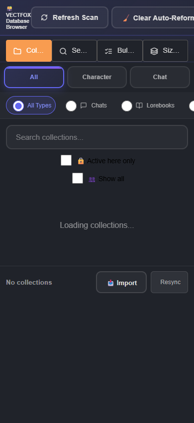
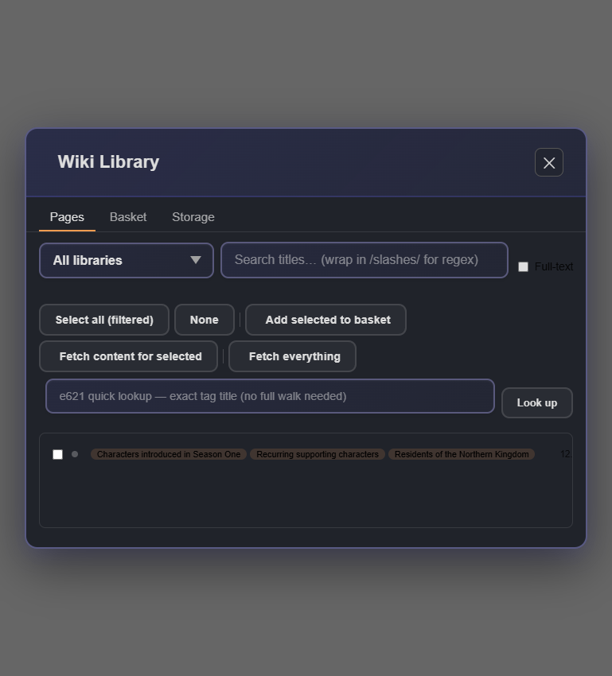

# Bug diagnosis: CLAUDE.md and browser/library CSS

Diagnosed on 2026-09-05 against commit a3be8d0, following `.agents/skills/diagnosing-bugs/SKILL.md`. Read `CONTEXT.md`; no dedicated ADR files were found by filename search. The prior dead-code cleanup is already in this checkout.

## Outcome

### Fixes implemented

The eight confirmed defects (1.1, 1.2, 1.3, 1.5–1.9) and both CSS bugs are now fixed. Regression tests cover the desired behavior, including the language hint through the real extraction/prompt path and PNG replacement with legacy metadata, repeated payloads, unrelated image/metadata chunks, and offset byte-array views.

- Unit validation: **1,473 tests passed across 46 files**, after first observing 15 failing regression assertions before the fixes.
- Responsive validation: both modals pass the geometry checks at **320, 390, 641, 768, 769, and 1440px**. Current metrics are in `diagnostics/bug-audit/css-results-current.json`; fixed screenshots are `database-390-current.png` and `wiki-769-current.png` in that directory. Visually verified the database Close button and wiki title/actions are visible.
- Database header actions wrap to fit. Wiki category badges truncate within a bounded area while retaining their full names in title attributes and text content.
- Corpus policy, differing language thresholds, and the unverified plugin-backend contract remain outside these fixes. Live SillyTavern integration was not exercised.

Current verification commands:

```powershell
npm test -- --reporter=dot
node diagnostics/bug-audit/reproduce-known-bugs.mjs
node diagnostics/bug-audit/reproduce-css.mjs
```

The known-bugs command now runs the permanent regression suites without rewriting tests. In-memory core probes were removed after promotion; their results below are historical diagnosis evidence. The helper command still flags the deferred backend-contract issue, so it is not an all-fixes acceptance command.

### Historical diagnosis

Eight of the eleven numbered findings in CLAUDE.md section 1 are reproducible code defects (1.1, 1.2, 1.3, 1.5–1.9). The cleanup backend finding (1.10) is a reproduced request-contract inconsistency, with actual server impact not established. Two findings (1.4, 1.11) need a policy decision before being called bugs. Two additional CSS layout defects were reproduced in actual repository markup/styles.

No production files or existing tests were changed during the initial diagnosis. The subsequent implementation is recorded above; the relevant wrong-behavior assertions have now been deliberately updated. The remaining sections describe the pre-fix investigation and its measurements.

## Feedback loops and evidence

Run from the repository root:

```powershell
node diagnostics/bug-audit/reproduce-known-bugs.mjs
node diagnostics/bug-audit/reproduce-helper-bugs.mjs
node diagnostics/bug-audit/reproduce-css.mjs
```

Each exits nonzero while its reported failures exist. Vitest/esbuild required an authorized run outside the filesystem sandbox to load the config. No live service, credentials, or user data is needed; the CSS harness uses installed Microsoft Edge in headless mode and sample theme variables. It does not contact the configured SillyTavern instance.

The core loop copies existing characterization fixtures into a temporary `.bug-repro` directory and changes only selected expectations to desired behavior. It leaves the original files untouched and removes the temporary files on exit. It ran twice with the same **12 failed assertions, 318 skipped** result; the initial run took 2.54 seconds. One of the 12 failures is the explicitly disputed corpus policy expectation. Representative failures:

```text
chunking: expected ['alpha\n\nbeta'] to deeply equal ['alpha', 'beta']
empty window: expected spy not to be called, but it was called once
planner: expected prompt to contain 'E1 [0.93]' (actual 'E1 [—]')
cache: expected 'anger' to be 'joy'
PNG re-embed: expected generation 2, received generation 1
PNG predicate: expected '1.0' to be true; expected undefined to be false
prompt lookup: expected 'function' to be 'string'
```

The fixtures isolate two paragraphs, blank named messages, a single scored candidate, two cache calls, two PNG generations, and prototype-key lookups. Host/network dependencies are mocked, while the production code under diagnosis executes. The helper loop extracts the current function bodies rather than copying their algorithms; its backend test mocks HTTP and registry mutation. It confirms the outgoing payload, not the remote plugin's response contract.

Ranked hypotheses were communicated before probes: (1) the guard/key/field/arithmetic directly causes each symptom, (2) a caller transforms the input, (3) the old fixture/finding is stale. For CSS: (1) flex sizing/non-wrapping, (2) responsive overrides, (3) missing host styles. Isolated in-memory transforms and page-only CSS overrides tested specific predictions. Production files were not edited for these probes.

## Current status of CLAUDE.md section 1

| ID | Verdict and minimal symptom | Cause, evidence, and fix direction |
|---|---|---|
| 1.1 | **Confirmed.** `alpha\n\nbeta` with section strategy returns one chunk instead of the documented paragraph fallback. | `core/chunking.js:238` appends the full trailing text before testing whether sections is empty. Checking whether a header exists before appending made the diagnostic pass. Track header matches explicitly; retain real section behavior. |
| 1.2 | **Confirmed.** Two named blank messages make one LLM request. | `core/eventbase-extractor.js:472` includes speaker labels in the string used by the empty guard at :480. A probe checking cleaned message bodies before adding labels passed. Check usable message content, preserving nonempty messages and caller indexing. |
| 1.3 | **Confirmed; file location in old log is stale.** Candidate `{_finalScore:0.93}` reaches the planner as `E1 [—]`. | Formatter now lives in `core/prompts-i18n.js:793`, not agentic-retrieval.js. It reads score/vectorScore while retrieval supplies _finalScore. Adding _finalScore precedence made the real planner-prompt test pass. |
| 1.4 | **Behavior confirmed; bug classification depends on corpus policy.** One four-token item plus three empty items returns N=4 and average=1. | `core/corpus-stats.js:175` uses all items in N and the divisor. This is consistent if zero-length documents belong to the corpus; excluding them would instead mean N=1 and average=4. The old log assumes exclusion without establishing that policy. Decide whether empty items are legitimate documents or records to discard, then keep document frequency, N, and averages consistent. Do not label the current arithmetic intrinsically wrong. |
| 1.5 | **Both defects confirmed.** Same 100-character prefix suppresses a second request; a model override's anger result is reused for a later default-model call expected to return joy. | `core/emotion-classifier.js:131` keys on truncated text and configured model, but the HTTP request uses complete text and effective model. A full-text/effective-model tuple made both diagnostics pass. |
| 1.6 | **Confirmed, latent API-contract defect.** Predicate returns version string or undefined. | `core/png-export.js:571` returns an &&/|| expression without boolean conversion. Wrapping that expression with Boolean passed both tests while preserving existing truthiness/legacy-version acceptance. Separately deciding which generators should be accepted is a compatibility change. The prior audit found no production importer of this predicate. |
| 1.7 | **Confirmed.** Embedding generation 2 into the generation-1 PNG still extracts generation 1. | `core/png-export.js:494` inserts another VectFox chunk and extraction stops at the first valid match. A diagnostic transform discarding previous matching VectFox text chunks before insertion made the latest-payload and one-chunk assertions pass. A production fix must preserve unrelated PNG chunks and supported metadata formats. |
| 1.8 | **Confirmed for all three prompt families.** `toString`/`constructor` produces functions. | `core/prompts-i18n.js:337`, :446, :734 uses inherited property lookup. Own-property lookup passed all three diagnostics. Retain fallback behavior for unsupported keys; do not remove the multilingual prompts. |
| 1.9 | **Confirmed in the actual helper.** One kana plus ten Latin letters (`あabcdefghij`) produces a Chinese-language hint instead of passing below its 15% threshold. | `core/eventbase-extractor.js:296` counts kana in the broad CJK range and adds kana again. Ratio is 2/12 rather than 1/11. Removing the extra addition changes the result to null. This particular label is Chinese because the separate Japanese rule requires more than five kana. The helper-level probe does not prove every caller's assembled excerpt gets the same hint: speaker labels also affect its ratio. |
| 1.10 | **Outgoing request inconsistency confirmed; plugin failure remains unverified.** Standard or missing backend emits `standard`; explicit vectra/qdrant passes through. | `core/collection-loader.js:675` defaults the discovered backend to standard; :709 forwards it unchanged in cleanupCorruptedCollections. The actual cleanup function was invoked with one `file_1` collection and mock fetch. Normalizing standard to vectra made its contract assertion pass. The plugin source/runtime is outside this repo, so do not claim a demonstrated production purge failure. This is the filtered/corrupt-collection cleanup path, not every removal path. |
| 1.11 | **Different heuristics confirmed, not independently proven broken.** | Summary token budgeting, broad script classification, and language hints have different purposes. Unifying their thresholds blindly could change token limits/language selection. Punctuation-inclusive ranges and kana duplication merit targeted cases; 1.9 provides a concrete failure. No user-visible failing scenario was established for threshold differences alone. |

## Isolated probe results

Commands use the same desired-behavior test run with one relevant production transform applied **only in memory**:

```powershell
node diagnostics/bug-audit/reproduce-known-bugs.mjs --probe=chunking
node diagnostics/bug-audit/reproduce-known-bugs.mjs --probe=empty-window
node diagnostics/bug-audit/reproduce-known-bugs.mjs --probe=scores
node diagnostics/bug-audit/reproduce-known-bugs.mjs --probe=cache
node diagnostics/bug-audit/reproduce-known-bugs.mjs --probe=boolean
node diagnostics/bug-audit/reproduce-known-bugs.mjs --probe=prompt-keys
node diagnostics/bug-audit/reproduce-known-bugs.mjs --probe=png-replace
node diagnostics/bug-audit/reproduce-helper-bugs.mjs --probe
```

| Probe | Targeted assertions passing | Other assertions still failing |
|---|---:|---:|
| Header detection | 1 | 11 |
| Empty message bodies | 1 | 11 |
| Final score field | 1 | 11 |
| Cache identity | 2 | 10 |
| Boolean conversion | 2 | 10 |
| Own prompt keys | 3 | 9 |
| PNG replace existing payload | 1 | 11 |

The helper probe also clears kana and backend-payload failures; vectra/qdrant control cases remain passing. These are causal probes, not production-ready patches or a passing full regression suite. Probe output is summarized in `diagnostics/bug-audit/probe-summary.json`.

## CSS findings

The harness executes the real modal-building function with an append capture and renders its markup with the complete vectfox.css import chain. For Wiki Library it also executes the real buildPageRow function through a minimal DOM adapter; click callbacks are deliberately not driven. It tests widths 1440, 769, 768, 641, 390, and 320 at height 850. Animation is disabled for deterministic measurements. It tests geometry in Edge, not all browsers, themes, font assets, UI interactions, or live host CSS.

### Database browser: header actions push Close offscreen

**Confirmed at 390px and 320px.** At 390px, the close button occupies x=500.41 to 536.41 while header client width is 390 and scroll width is 536. The modal clips the overflow, making Close unavailable onscreen.

- Trigger: normal database-browser shell, no collection data required.
- Cause: `ui/database-browser.js:214` uses an inline flex action group without wrapping; the shared flex header (`styles/modals.css:87`) does not wrap either. Long Refresh Scan and Clear Auto-Reformat Originals controls consume the horizontal space.
- Probe: scope wrapping to the database header and its action group, limiting the group's width to 100%. Database cases all pass; the wiki failures remain. This identifies a layout constraint rather than a data-loading failure.
- Fix direction: give header actions an explicit responsive layout, keep Close reachable, and verify long/localized labels. The probe demonstrates wrapping; final UX may move secondary actions into a menu.



### Wiki Library: category badges consume the title and action space

**Confirmed at 641px, 768px, and 769px.** One page with three ordinary-length category names is enough. At 769px the row is 661.47px wide, its title is **0px**, and the action group extends to x=826.39, outside the viewport and the clipped modal.

- Trigger: one unfetched page titled Example page, with categories Characters introduced in Season One; Recurring supporting characters; Residents of the Northern Kingdom. No large list or network state is needed. A single category in the initial control fixture did not reproduce it.
- Cause: `.vectfox-wl-badges` at `ui/wiki-library.css:222` cannot shrink; each badge is nowrap; title at :208 is the flex item allowed to shrink to zero. Category badges only disappear below the separate 640px breakpoint at :350, leaving the intermediate widths exposed.
- Probe: cap the badge group to 35% and hide its overflow in the diagnostic page. All measured Wiki Library cases pass; database failures remain. This is sufficient causal evidence, not a final accessible presentation for truncated categories.
- Fix direction: constrain/wrap badges or move them below the title; reserve readable title width and reachable actions. Keep category information accessible through a tooltip/expansion rather than silently discarding it.



Probe commands:

```powershell
node diagnostics/bug-audit/reproduce-css.mjs --probe=header
node diagnostics/bug-audit/reproduce-css.mjs --probe=badges
```

Other observations are not promoted to confirmed bugs: the wiki mobile search input becomes narrow (~48px at 390px in this fixture), but remains operable; database filter rows can intentionally scroll; missing host colors/fonts are not evidence of a production contrast defect. Empty-shell checks at 1440/768 passed initially; populated-row checks were necessary to expose the wiki issue.

## CLAUDE.md section 2 and older cleanup notes

| Earlier item | Current assessment |
|---|---|
| eventbase-store hash docstring | Still misleading at :826: nearby code/documentation describes a two-seed 53-bit hash, not the alleged matching routines. Documentation defect; no hash corruption reproduced here. Do not change stored event IDs to repair a comment. |
| collection-export standard/vectra ternary | Stale: current code uses getRegistryBackend. No remaining instance of the reported ternary at that location. |
| agentic planner unknown-provider throw | Stale: _callPlanner delegates to callChatCompletion; the old branch is absent. Unknown-provider configuration is rejected earlier. |
| summarizer unused originalLength and default timeout | Still present as API/cleanup concerns. originalLength is only mentioned by a commented log; its helper default timeout is used. No timing failure was described or reproduced. |
| api-keys ignored settings arguments | Deliberate compatibility parameters, explicitly documented at :170 and :186. No observed defect. |
| redundant String coercions | The broad claim is not safe: current :89 uses String in the non-string branch. Other redundant conversions, where proven, are cleanup rather than reproduced runtime bugs. |
| pointless aliases | Style/maintenance findings; no reported failing behavior. Line numbers have shifted and should not drive mechanical edits. |
| empty catches | No blanket defect established. Best-effort notification/cleanup paths may intentionally swallow errors, and host globals may be absent. Each needs a concrete lost-error symptom before removal. |

Sections 3 and 4 contain dead-code/refactoring findings, not an additional bug specification. The strong dead-code removals were handled earlier; external APIs, defensive tripwires, and deliberately independent reformat/EventBase logic remain outside this diagnosis's fix scope. The old log's claim that nothing has been changed is historical and no longer a current status statement.

## Recommended next work

1. Fix the two reproduced CSS reachability issues and preserve the browser geometry cases as focused regression checks.
2. Fix stale PNG replacement and classifier cache identity, which can return the wrong data; then empty-window requests, planner score propagation, and section fallback.
3. Fix boolean return/own-key lookup/kana counting with their focused fixtures.
4. Verify the cleanup backend contract against the plugin before changing that integration; decide empty-document corpus policy before changing statistics.

When implementing, convert each relevant wrong-behavior characterization assertion deliberately and rerun the normal suite plus the original reproduction. The diagnostic probes are not substitutes for that work. No debug logging was injected into production, and generated scratch tests were removed. Repro tools and selected artifacts are intentionally retained under the clearly marked diagnostic directory.
